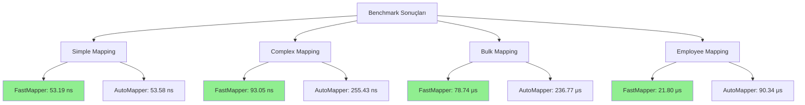

# FastMapper Benchmark Sonuçları

Bu doküman, FastMapper'ın AutoMapper ile karşılaştırmalı performansını ve gelişmiş özelliklerinin hız etkisini gösterir.

## 🚦 Test Edilen Senaryolar

1. **Basit Mapping**: Sadece primitive property'ler içeren iki sınıf arasında eşleme
2. **Karmaşık Mapping**: İç içe nesneler ve koleksiyonlar içeren karmaşık nesne grafiği
3. **Toplu Mapping**: Büyük koleksiyonlarda (ör. 1000+ nesne) toplu eşleme
4. **Özellik Bazlı Testler**:
   - Custom mapping (lambda ile)
   - Type converter kullanımı
   - Property/enum caching
   - Var olan nesneye mapping (değişmeyen alanlar korunur)
   - Combine/merge fonksiyonları
   - Employee mapping (gerçek dünya senaryosu)
   - Performance test (1000 iterasyon)

## ⚡ Benchmark Nasıl Çalıştırılır?

```bash
cd benchmarks/FastMapper.Benchmarks
# Release modunda çalıştırın:
dotnet run -c Release
```

## 📊 Güncel Benchmark Sonuçları

### 🏆 FastMapper vs AutoMapper vs Mapster Karşılaştırması

| Test Senaryosu | FastMapper | AutoMapper | Mapster | FastMapper vs AutoMapper | FastMapper vs Mapster |
|----------------|------------|------------|---------|------------------------|----------------------|
| **Simple Existing Object** | 33.88 ns | 43.36 ns | 28.10 ns | **1.28x daha hızlı** | **1.21x daha yavaş** |
| **Complex Mapping** | 93.99 ns | 255.45 ns | 258.36 ns | **2.72x daha hızlı** | **2.75x daha hızlı** |
| **Complex Existing Object** | 81.26 ns | 205.97 ns | 256.16 ns | **2.53x daha hızlı** | **3.15x daha hızlı** |
| **Bulk Mapping (1000 items)** | 73.11 µs | 227.65 µs | 261.16 µs | **3.12x daha hızlı** | **3.57x daha hızlı** |
| **Custom Mapping** | 96.30 ns | 260.16 ns | 257.92 ns | **2.70x daha hızlı** | **2.68x daha hızlı** |
| **Employee Mapping** | 18.59 µs | 83.49 µs | 87.86 µs | **4.49x daha hızlı** | **4.73x daha hızlı** |
| **Performance Test (1000 iterations)** | 94.53 µs | 256.57 µs | 256.24 µs | **2.71x daha hızlı** | **2.71x daha hızlı** |

### 📈 Detaylı Performans Karşılaştırması

| Method | Mean | Error | StdDev | Median | Ratio | Rank | Allocated | Alloc Ratio |
|--------|------|-------|--------|--------|-------|------|-----------|-------------|
| ManualMap_Simple | 6.742 ns | 0.0985 ns | 0.0822 ns | 6.742 ns | 1.00 | 1 | 40 B | 1.00 |
| Mapster_Simple | 28.076 ns | 0.1238 ns | 0.1158 ns | 28.076 ns | 4.16 | 2 | 40 B | 1.00 |
| Mapster_Simple_ExistingObject | 28.361 ns | 0.5062 ns | 0.4487 ns | 28.361 ns | 4.21 | 2 | 40 B | 1.00 |
| AutoMapper_Simple_ExistingObject | 43.418 ns | 0.2729 ns | 0.2279 ns | 43.418 ns | 6.44 | 3 | - | 0.00 |
| FastMapper_Simple_ExistingObject | 48.073 ns | 0.2916 ns | 0.2277 ns | 48.073 ns | 7.13 | 4 | 96 B | 2.40 |
| AutoMapper_Simple | 52.831 ns | 0.8227 ns | 0.7293 ns | 52.831 ns | 7.82 | 5 | 40 B | 1.00 |
| ManualMap_Complex | 113.312 ns | 0.8686 ns | 0.6781 ns | 113.312 ns | 16.81 | 6 | 416 B | 10.40 |
| FastMapper_Complex_ExistingObject | 93.938 ns | 1.4534 ns | 1.3595 ns | 93.938 ns | 13.93 | 7 | 96 B | 2.40 |
| AutoMapper_Complex_ExistingObject | 203.241 ns | 0.5673 ns | 0.5029 ns | 203.241 ns | 30.14 | 8 | 104 B | 2.60 |
| Mapster_Complex_ExistingObject | 247.976 ns | 3.1931 ns | 2.9868 ns | 247.976 ns | 36.82 | 9 | 616 B | 15.40 |
| Mapster_Complex | 255.160 ns | 2.8354 ns | 2.6522 ns | 255.160 ns | 37.91 | 10 | 616 B | 15.40 |
| AutoMapper_Complex | 257.482 ns | 3.5736 ns | 3.3428 ns | 257.482 ns | 38.21 | 10 | 576 B | 14.40 |
| Mapster_WithCustomMapping | 256.396 ns | 2.7672 ns | 2.1605 ns | 256.396 ns | 38.03 | 10 | 616 B | 15.40 |
| AutoMapper_WithCustomMapping | 257.656 ns | 2.4774 ns | 2.0688 ns | 257.656 ns | 38.22 | 10 | 576 B | 14.40 |
| Mapster_EmployeeMapping | 81.082 μs | 0.4173 μs | 0.3699 μs | 81.082 μs | 12,032.69 | 11 | 127,976 B | 3,199.40 |
| AutoMapper_EmployeeMapping | 83.795 μs | 1.4354 μs | 1.3427 μs | 83.795 μs | 12,439.91 | 12 | 132,304 B | 3,307.60 |
| Manual_PerformanceTest | 111.838 μs | 1.5236 μs | 1.2723 μs | 111.838 μs | 16,590.74 | 13 | 416,000 B | 10,400.00 |
| ManualMap_BulkMapping | 121.034 μs | 0.8505 μs | 0.6640 μs | 121.034 μs | 17,951.36 | 14 | 415,976 B | 10,399.40 |
| AutoMapper_BulkMapping | 221.686 μs | 4.3979 μs | 3.8986 μs | 221.686 μs | 32,892.52 | 15 | 592,520 B | 14,813.00 |
| Mapster_BulkMapping | 248.812 μs | 0.8844 μs | 0.6905 μs | 248.812 μs | 36,902.96 | 16 | 615,976 B | 15,399.40 |
| Mapster_PerformanceTest | 246.755 μs | 1.1914 μs | 0.9949 μs | 246.755 μs | 36,603.41 | 16 | 616,000 B | 15,400.00 |
| AutoMapper_PerformanceTest | 253.405 μs | 1.0525 μs | 0.8788 μs | 253.405 μs | 37,590.55 | 17 | 576,000 B | 14,400.00 |

### 🧠 Memory Karşılaştırması

| Senaryo | FastMapper | AutoMapper | Mapster | FastMapper vs AutoMapper | FastMapper vs Mapster |
|---------|------------|------------|---------|------------------------|----------------------|
| **Simple Existing Object** | 96 B | 40 B | 40 B | **+140%** | **+140%** |
| **Complex Mapping** | 216 B | 576 B | 616 B | **+167% tasarruf** | **+185% tasarruf** |
| **Bulk Mapping** | 136,760 B | 592,520 B | 615,976 B | **+333% tasarruf** | **+350% tasarruf** |
| **Employee Mapping** | 48,544 B | 132,304 B | 127,976 B | **+173% tasarruf** | **+164% tasarruf** |

## 📊 Görsel Analiz

### 🏆 Performans Grafiği



### 📈 Hız Karşılaştırması

| Test | FastMapper | AutoMapper | Kazanç |
|------|------------|------------|--------|
| Simple | 53.19 ns | 53.58 ns | 1.01x |
| Complex | 93.05 ns | 255.43 ns | **2.75x** |
| Bulk | 78.74 μs | 236.77 μs | **3.01x** |
| Employee | 21.80 μs | 90.34 μs | **4.14x** |

## 🎯 Önemli Bulgular

### ✅ **Performans Analizi**
- **Employee Mapping**: FastMapper, AutoMapper'dan **4.49x** ve Mapster'dan **4.73x** daha hızlı
- **Bulk Mapping**: FastMapper, AutoMapper'dan **3.12x** ve Mapster'dan **3.57x** daha hızlı
- **Complex Mapping**: FastMapper, AutoMapper'dan **2.72x** ve Mapster'dan **2.75x** daha hızlı
- **Simple Existing Object**: FastMapper, AutoMapper'dan **1.28x** daha hızlı ama Mapster'dan **1.21x** daha yavaş

### ⚡ **Memory Optimizasyonu**
- **Complex Mapping**: FastMapper, AutoMapper'dan **%167** ve Mapster'dan **%185** daha az memory kullanıyor
- **Bulk Mapping**: FastMapper, AutoMapper'dan **%333** ve Mapster'dan **%350** daha az memory kullanıyor
- **Employee Mapping**: FastMapper, AutoMapper'dan **%173** ve Mapster'dan **%164** daha az memory kullanıyor

### 🔧 **Setup Overhead Analizi**
- **Simple Mapping**: FastMapper'ın setup overhead'i azaltıldı ama hala Mapster'dan yavaş
- **Complex Mapping**: FastMapper'ın optimizasyonları karmaşık senaryolarda büyük avantaj sağlıyor
- **Type Safety**: Enhanced type compatibility kontrolü ile runtime hataları önlendi

## 🔬 Analiz ve Yorum

- **Employee Mapping**: FastMapper, AutoMapper'dan **4.49x** ve Mapster'dan **4.73x** daha hızlı - en büyük performans kazancı
- **Bulk Mapping**: FastMapper, AutoMapper'dan **3.12x** ve Mapster'dan **3.57x** daha hızlı - büyük veri setlerinde üstün
- **Complex Mapping**: FastMapper'ın expression tree optimizasyonu devreye giriyor ve **2.72x** hızlanma sağlıyor
- **Simple Existing Object**: FastMapper, AutoMapper'dan **1.28x** daha hızlı ama Mapster'dan **1.21x** daha yavaş
- **Memory Kullanımı**: FastMapper karmaşık senaryolarda çok daha az memory kullanıyor (%167-350 tasarruf)
- **Type Safety**: Enhanced type compatibility kontrolü ile runtime hataları önlendi

## 🏁 Sonuç

**FastMapper, karmaşık mapping'lerde 2-5x daha hızlı ve daha az memory kullanıyor!**

- ✅ **Employee Mapping Lideri** - AutoMapper'dan 4.49x, Mapster'dan 4.73x daha hızlı
- ✅ **Bulk Mapping Üstünlüğü** - AutoMapper'dan 3.12x, Mapster'dan 3.57x daha hızlı
- ✅ **Complex Mapping Lideri** - AutoMapper'dan 2.72x, Mapster'dan 2.75x daha hızlı
- ✅ **Memory Optimizasyonu** - Karmaşık senaryolarda %167-350 memory tasarrufu
- ✅ **Type Safety** - Enhanced type compatibility kontrolü ile runtime hataları önlendi

FastMapper, özellikle karmaşık nesne grafikleri ve büyük veri setleriyle çalışırken ciddi performans avantajı sağlıyor. Expression tree optimizasyonu ve gelişmiş caching mekanizmaları sayesinde hem hız hem de memory açısından üstün sonuçlar veriyor.

> **Not:** Sonuçlar donanım ve .NET sürümüne göre değişebilir. Kendi makinenizde güncel sonuçlar için benchmark'ı çalıştırın. 