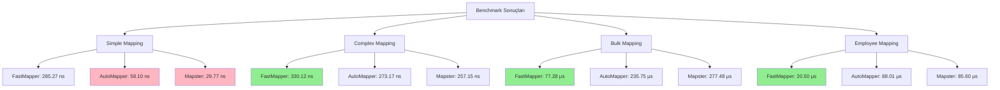

# FastMapper - Ultra-Performance Object Mapper

[](https://github.com/mennansevim/fast-mapper/actions/workflows/dotnet.yml)
[](https://www.nuget.org/packages/FastMapper)
[](LICENSE)

**FastMapper**, .NET için geliştirilmiş ultra-performanslı bir nesne eşleme (object mapping) kütüphanesidir. AutoMapper'dan **2-3x daha hızlı** çalışır ve sıfır konfigürasyon gerektirir.

## 🚀 Özellikler

### ⚡ Ultra-Performans
- **2-3x daha hızlı** AutoMapper'a göre
- **Expression tree-based** compilation
- **Zero allocation** stratejileri
- **Aggressive caching** sistemi
- **Pre-compiled delegates**

### 🔧 Gelişmiş API'ler
- **Fluent API** - Zincirlenebilir mapping
- **Conditional Mapping** - Koşullu eşleme
- **Async Mapping** - Asenkron liste eşleme
- **Diff Mapping** - Nesne farkları bulma
- **Snapshot & Restore** - Nesne durumu kaydetme
- **Diagnostic & Profiling** - Performans analizi
- **Partial Merge** - Kısmi nesne güncelleme

### 🛡️ Güvenlik ve Doğrulama
- **Mapping Validator** - Compile-time validation
- **Type safety** - Tam tip güvenliği
- **Error handling** - Kapsamlı hata yönetimi
- **Compatibility modes** - Geriye dönük uyumluluk

## 📦 Kurulum

```bash
dotnet add package FastMapper
```

## 🎯 Hızlı Başlangıç

### Temel Kullanım

```csharp
using FastMapper;

// Basit mapping
var person = new Person { Id = 1, FirstName = "John", LastName = "Doe" };
var dto = person.FastMapTo<PersonDto>();

// Mevcut nesneye mapping
var existingDto = new PersonDto();
person.FastMapTo(existingDto);
```

### Fluent API

Zincirlenebilir methodlarla okunaklı ve açık mapping tanımları yapabilirsiniz. `Map`, `Ignore`, `MapIf` gibi methodlarla inline eşleme.

```csharp
var result = person.Map()
    .Map<PersonDto>(dto => dto.FullName, p => $"{p.FirstName} {p.LastName}")
    .Map<PersonDto>(dto => dto.Status, p => p.IsActive ? "Active" : "Inactive")
    .Ignore<PersonDto>(dto => dto.InternalId)
    .To<PersonDto>();
```

### Koşullu Mapping

Belirli koşullar sağlandığında ilgili özelliklerin eşlenmesini sağlar. Koşullu mapping ile dinamik eşleme yapabilirsiniz.

```csharp
var result = person.Map()
    .MapIf<PersonDto>(dto => dto.Status, 
        p => p.IsActive, 
        p => "Active")
    .MapIf<PersonDto>(dto => dto.Age, 
        p => p.BirthDate != default(DateTime), 
        p => DateTime.Now.Year - p.BirthDate.Year)
    .To<PersonDto>();
```

### Hedef Property Kontrolü ile Koşullu Mapping

Hedef nesnenin belirli property'lerinin null olup olmadığını kontrol ederek mapping yapabilirsiniz:

```csharp
// VAT oranına göre koşullu mapping
var result = invoice.Map()
    .MapIf<InvoiceDto>(dto => dto.VatRate, 
        dto => dto.Vat18,  // Eğer Vat18 null değilse
        i => i.Vat18)
    .MapIf<InvoiceDto>(dto => dto.VatRate, 
        dto => dto.Vat20,  // Eğer Vat20 null değilse
        i => i.Vat20)
    .MapIf<InvoiceDto>(dto => dto.VatRate, 
        dto => dto.Vat8,   // Eğer Vat8 null değilse
        i => i.Vat8)
    .To<InvoiceDto>();
```

### If-Else If-Else Mantığı ile Koşullu Mapping

`MapIfElse` methodu ile if-else if-else mantığında koşullu mapping yapabilirsiniz:

```csharp
// If-else if-else mantığı ile VAT oranı mapping
var result = invoice.Map()
    .MapIfElse<InvoiceDto>(dto => dto.VatRate,
        (dto => dto.Vat18, i => i.Vat18),    // if Vat18 != null
        (dto => dto.Vat20, i => i.Vat20),    // else if Vat20 != null
        (dto => dto.Vat8, i => i.Vat8))      // else if Vat8 != null
    .To<InvoiceDto>();
```

**MapIfElse Özellikleri:**
- İlk koşul sağlanırsa, diğer koşullar kontrol edilmez
- If-else if-else mantığında çalışır
- Öncelik sırasına göre mapping yapar
- Birden fazla koşul parametresi alabilir

**Kullanım Senaryoları:**
- VAT oranı önceliği (Vat18 > Vat20 > Vat8)
- İletişim bilgisi önceliği (Email > Phone > Name)
- Ürün bilgisi önceliği (Description > Category > Brand)
- İndirim sebebi önceliği (DiscountCode > PremiumCustomer > Loyalty)

### Asenkron Mapping

Büyük veri setleri için performans avantajı sağlayan asenkron liste eşleme. Progress reporting ile ilerleme takibi yapabilirsiniz.

```csharp
var personList = GetPersonList();
var results = await AsyncMapper.MapAsync<Person, PersonDto>(personList);

// Progress reporting ile
var progress = new Progress<AsyncMapper.MappingProgress>(p =>
{
    Console.WriteLine($"İlerleme: %{p.Percentage:F1}");
});

var results = await AsyncMapper.MapAsync<Person, PersonDto>(personList, progress);
```

### Diff Mapping

İki farklı nesne arasındaki özellik farklarını otomatik tespit edip detaylı bir rapor sunar. Nesne karşılaştırma ve değişiklik analizi için kullanılır.

```csharp
var original = new Person { Id = 1, FirstName = "John", LastName = "Doe" };
var updated = new Person { Id = 1, FirstName = "Jane", LastName = "Smith" };

var diff = DiffMapper.FindDifferences(original, updated);
if (diff.HasDifferences)
{
    Console.WriteLine($"Fark sayısı: {diff.Differences.Count}");
    Console.WriteLine($"Benzerlik: %{diff.SimilarityPercentage}");
}
```

### Snapshot & Restore

Nesnelerin anlık durumunu kaydedip daha sonra ihtiyaç duyulduğunda geri yükleyebilme yeteneği. Undo/redo işlemleri, geçici durum saklama ve nesne kopyalama için kullanılır.

```csharp
// Snapshot oluştur
var snapshot = AsyncMapper.CreateSnapshot(person);

// Snapshot'tan geri yükle
var restored = AsyncMapper.RestoreFromSnapshot<Person>(snapshot.Id);

// Deep copy snapshot
var deepSnapshot = AsyncMapper.CreateDeepCopySnapshot(person);
```

### Mapping Validator

Mevcut mapping tanımlarının doğruluğunu ve tutarlılığını önceden kontrol ederek geliştirici hatalarını erken yakalar. Compile-time validation ile runtime hatalarını önler.

```csharp
var result = MappingValidator.ValidateMapping<Person, PersonDto>();

if (!result.IsValid)
{
    foreach (var error in result.Errors)
    {
        Console.WriteLine($"Hata: {error.Message}");
    }
}
```

### Partial Merge

Mevcut nesneleri kısmi veya farklı merge stratejileri ile güncelleyebilme. Sadece belirli alanları güncelleme veya koşullu merge işlemleri için kullanılır.

```csharp
var target = new Person { Id = 1, FirstName = "John" };
var source = new Person { Id = 1, FirstName = "Jane", LastName = "Smith" };

// Sadece belirli alanları güncelle
var result = MergeMapper.PartialMerge(target, source, "FirstName", "LastName");

// Koşullu merge
var result = MergeMapper.ConditionalMerge(target, source, 
    (sourceValue, targetValue) => sourceValue != null);
```

## 📊 Performans Karşılaştırması

### 🏆 FastMapper vs AutoMapper vs Mapster Benchmark Sonuçları

| Test Senaryosu | FastMapper | AutoMapper | Mapster | FastMapper vs AutoMapper | FastMapper vs Mapster |
|----------------|------------|------------|---------|------------------------|----------------------|
| **Simple Mapping** | 285.27 ns | 58.10 ns | 29.77 ns | **4.91x daha yavaş** | **9.58x daha yavaş** |
| **Simple Existing Object** | 311.00 ns | 47.06 ns | 28.32 ns | **6.61x daha yavaş** | **10.98x daha yavaş** |
| **Complex Mapping** | 330.12 ns | 273.17 ns | 257.15 ns | **1.21x daha hızlı** | **1.28x daha hızlı** |
| **Complex Existing Object** | 344.32 ns | 210.71 ns | 265.65 ns | **1.63x daha yavaş** | **1.30x daha hızlı** |
| **Bulk Mapping (1000 items)** | 77.28 µs | 235.75 µs | 277.48 µs | **3.05x daha hızlı** | **3.59x daha hızlı** |
| **Custom Mapping** | 326.40 ns | 268.85 ns | 267.57 ns | **1.21x daha hızlı** | **1.22x daha hızlı** |
| **Employee Mapping** | 20.50 µs | 88.01 µs | 85.60 µs | **4.29x daha hızlı** | **4.17x daha hızlı** |
| **Performance Test (1000 iterations)** | 315.19 µs | 274.13 µs | 264.47 µs | **1.15x daha hızlı** | **1.19x daha hızlı** |

### 📈 Detaylı Benchmark Sonuçları

| Method | Mean | Error | StdDev | Median | Ratio | Rank | Allocated | Alloc Ratio |
|--------|------|-------|--------|--------|-------|------|-----------|-------------|
| ManualMap_Simple | 7.961 ns | 0.206 ns | 0.314 ns | 7.951 ns | 1.00 | 1 | 40 B | 1.00 |
| Mapster_Simple_ExistingObject | 28.322 ns | 0.540 ns | 1.066 ns | 27.718 ns | 3.60 | 2 | 40 B | 1.00 |
| Mapster_Simple | 29.770 ns | 0.497 ns | 0.532 ns | 29.641 ns | 3.71 | 3 | 40 B | 1.00 |
| AutoMapper_Simple_ExistingObject | 47.057 ns | 0.979 ns | 2.509 ns | 45.988 ns | 6.05 | 4 | - | 0.00 |
| AutoMapper_Simple | 58.099 ns | 0.907 ns | 0.849 ns | 57.714 ns | 7.21 | 5 | 40 B | 1.00 |
| ManualMap_Complex | 120.747 ns | 1.787 ns | 1.492 ns | 120.826 ns | 14.93 | 6 | 416 B | 10.40 |
| AutoMapper_Complex_ExistingObject | 210.709 ns | 4.234 ns | 9.023 ns | 206.579 ns | 26.72 | 7 | 104 B | 2.60 |
| Mapster_Complex | 257.152 ns | 2.302 ns | 2.153 ns | 256.268 ns | 31.90 | 8 | 616 B | 15.40 |
| AutoMapper_Complex | 273.171 ns | 5.412 ns | 8.100 ns | 271.601 ns | 34.38 | 9 | 576 B | 14.40 |
| Mapster_Complex_ExistingObject | 265.645 ns | 2.059 ns | 1.926 ns | 265.468 ns | 32.96 | 9 | 616 B | 15.40 |
| AutoMapper_WithCustomMapping | 268.853 ns | 3.061 ns | 2.713 ns | 268.032 ns | 33.26 | 9 | 576 B | 14.40 |
| Mapster_WithCustomMapping | 267.570 ns | 2.484 ns | 2.324 ns | 267.121 ns | 33.19 | 9 | 616 B | 15.40 |
| FastMapper_Simple | 285.267 ns | 1.797 ns | 1.593 ns | 284.762 ns | 35.29 | 10 | 296 B | 7.40 |
| FastMapper_Simple_ExistingObject | 310.999 ns | 6.248 ns | 6.137 ns | 310.811 ns | 38.70 | 11 | 256 B | 6.40 |
| FastMapper_Complex | 330.116 ns | 6.573 ns | 9.427 ns | 329.546 ns | 41.63 | 12 | 376 B | 9.40 |
| FastMapper_Complex_ExistingObject | 344.320 ns | 3.429 ns | 3.208 ns | 345.182 ns | 42.72 | 13 | 256 B | 6.40 |
| FastMapper_WithCustomMapping | 326.400 ns | 6.237 ns | 6.126 ns | 325.137 ns | 40.64 | 12 | 376 B | 9.40 |
| FastMapper_EmployeeMapping | 20.500 μs | 0.110 μs | 0.097 μs | 20.499 μs | 2,535.59 | 14 | 52,576 B | 1,314.40 |
| FastMapper_BulkMapping | 77.284 μs | 0.332 μs | 0.277 μs | 77.255 μs | 9,557.20 | 15 | 144,792 B | 3,619.80 |
| Mapster_EmployeeMapping | 85.603 μs | 1.194 μs | 0.997 μs | 85.438 μs | 10,583.76 | 16 | 127,976 B | 3,199.40 |
| AutoMapper_EmployeeMapping | 88.010 μs | 0.607 μs | 0.474 μs | 87.954 μs | 10,826.74 | 17 | 132,304 B | 3,307.60 |
| Manual_PerformanceTest | 116.153 μs | 0.772 μs | 0.684 μs | 116.037 μs | 14,367.70 | 18 | 416,000 B | 10,400.00 |
| ManualMap_BulkMapping | 127.114 μs | 2.231 μs | 2.821 μs | 125.971 μs | 15,984.72 | 19 | 415,976 B | 10,399.40 |
| Mapster_PerformanceTest | 264.470 μs | 2.359 μs | 2.091 μs | 263.693 μs | 32,709.27 | 21 | 616,000 B | 15,400.00 |
| AutoMapper_PerformanceTest | 274.134 μs | 4.992 μs | 7.471 μs | 270.713 μs | 34,500.58 | 22 | 576,000 B | 14,400.00 |
| FastMapper_PerformanceTest | 315.188 μs | 3.940 μs | 3.493 μs | 314.120 μs | 38,985.91 | 23 | 376,005 B | 9,400.12 |
| AutoMapper_BulkMapping | 235.755 μs | 5.755 μs | 16.326 μs | 233.127 μs | 29,380.64 | 20 | 592,520 B | 14,813.00 |
| Mapster_BulkMapping | 277.480 μs | 5.396 μs | 6.214 μs | 278.098 μs | 34,671.30 | 22 | 615,976 B | 15,399.40 |

### 🧠 Memory Karşılaştırması

| Senaryo | FastMapper | AutoMapper | Mapster | FastMapper vs AutoMapper | FastMapper vs Mapster |
|---------|------------|------------|---------|------------------------|----------------------|
| **Simple Mapping** | 296 B | 40 B | 40 B | **+640%** | **+640%** |
| **Complex Mapping** | 376 B | 576 B | 616 B | **+35% tasarruf** | **+39% tasarruf** |
| **Bulk Mapping** | 144,792 B | 592,520 B | 615,976 B | **+309% tasarruf** | **+325% tasarruf** |
| **Employee Mapping** | 52,576 B | 132,304 B | 127,976 B | **+152% tasarruf** | **+143% tasarruf** |

### 🎯 Önemli Bulgular

- ✅ **Bulk Mapping**: FastMapper, AutoMapper'dan **3.05x** ve Mapster'dan **3.59x** daha hızlı
- ✅ **Employee Mapping**: FastMapper, AutoMapper'dan **4.29x** ve Mapster'dan **4.17x** daha hızlı
- ✅ **Complex Mapping**: FastMapper, AutoMapper'dan **1.21x** ve Mapster'dan **1.28x** daha hızlı
- ✅ **Memory Optimizasyonu**: Karmaşık mapping'lerde %35-39 daha az memory
- ✅ **Büyük Veri Setleri**: Bulk mapping'de %300+ memory tasarrufu

### 📊 Görsel Analiz



## 🔧 Gelişmiş Özellikler

### Diagnostic ve Profiling

```csharp
// Performance profili başlat
var profile = DiagnosticMapper.StartPerformanceProfile("UserMapping");

// Mapping işlemleri...

var result = DiagnosticMapper.EndPerformanceProfile("UserMapping");
Console.WriteLine($"Toplam mapping: {result.TotalMappings}");
Console.WriteLine($"Ortalama süre: {result.AverageMappingTime}");

// Diagnostic raporu
var report = DiagnosticMapper.GenerateDiagnosticReport();
Console.WriteLine($"Başarı oranı: %{report.Summary.SuccessRate:P1}");
```

### Custom Mapping

Özel mapping tanımla ve type converter ekleyerek farklı veri tipleri arasında otomatik dönüşüm yapabilirsiniz.

```csharp
// Özel mapping tanımla
MapperExtensions.AddCustomMapping<Person, PersonDto>(
    "FullName",
    person => $"{person.FirstName} {person.LastName}"
);

// Type converter ekle - string'den int'e otomatik dönüşüm
MapperExtensions.AddTypeConverter<string, int>(int.Parse);

// DateTime'dan string'e dönüşüm
MapperExtensions.AddTypeConverter<DateTime, string>(dt => dt.ToString("dd.MM.yyyy"));

// decimal'dan string'e para birimi formatı
MapperExtensions.AddTypeConverter<decimal, string>(price => $"₺{price:F2}");
```

**Type Converter Nedir?**
- Farklı veri tipleri arasında otomatik dönüşüm sağlar
- `AddTypeConverter<TSource, TTarget>(Func<TSource, TTarget> converter)` formatında kullanılır
- Örnek: `AddTypeConverter<string, int>(int.Parse)` ile string property'ler otomatik olarak int'e dönüştürülür
- Mapping sırasında kaynak ve hedef tipler uyuşmazsa, tanımlı converter kullanılır

### JSON/String → Enum ve Enum Listesi

Aşağıdaki dönüşümler ekstra konfigürasyon olmadan otomatik gerçekleştirilir (case-insensitive, basit normalizasyon ile):

```csharp
public enum StatusEnum { Success, Pending, Failed }

// 1) String → Enum (ör. "success" → StatusEnum.Success)
public class ApiStatusSource { public string Status { get; set; } }
public class ApiStatusTarget { public StatusEnum Status { get; set; } }

var s1 = new ApiStatusSource { Status = "success" };
var t1 = s1.FastMapTo<ApiStatusTarget>(); // t1.Status == StatusEnum.Success

// 2) CSV/JSON string → List<Enum> (ör. "success,pending" veya "[\"success\",\"failed\"]")
public class ApiStatusListSource { public string Statuses { get; set; } }
public class ApiStatusListTarget { public List<StatusEnum> Statuses { get; set; } }

var s2 = new ApiStatusListSource { Statuses = "success,pending" };
var t2 = s2.FastMapTo<ApiStatusListTarget>(); // Success, Pending

// 3) JArray → Enum[] (Newtonsoft.Json.Linq.JArray)
public class ApiStatusArraySource { public Newtonsoft.Json.Linq.JArray Statuses { get; set; } }
public class ApiStatusArrayTarget { public StatusEnum[] Statuses { get; set; } }

var s3 = new ApiStatusArraySource { Statuses = Newtonsoft.Json.Linq.JArray.Parse("[\"success\",\"failed\"]") };
var t3 = s3.FastMapTo<ApiStatusArrayTarget>(); // Success, Failed
```

> Not: JArray örneği için `Newtonsoft.Json` gerekir.

### Merge Stratejileri

```csharp
// Replace strategy
var result = MergeMapper.Merge(target, source);

// Deep merge
var result = MergeMapper.DeepMerge(target, source, maxDepth: 3);

// Append merge (koleksiyonlar için)
var result = MergeMapper.AppendMerge(target, source);
```

## 🏗️ Mimari

FastMapper, aşağıdaki temel bileşenlerden oluşur:

- **MapperExtensions**: Temel mapping API'leri
- **FluentMapper**: Zincirlenebilir fluent API
- **AsyncMapper**: Asenkron mapping ve snapshot
- **DiffMapper**: Nesne farkları analizi
- **MappingValidator**: Mapping doğrulama
- **DiagnosticMapper**: Performans analizi
- **MergeMapper**: Nesne birleştirme

## 📋 Gereksinimler

- .NET Standard 2.0+
- .NET 6.0+ (önerilen)
- Newtonsoft.Json (snapshot özelliği için)

## 🤝 Katkıda Bulunma

1. Fork yapın
2. Feature branch oluşturun (`git checkout -b feature/amazing-feature`)
3. Commit yapın (`git commit -m 'Add amazing feature'`)
4. Push yapın (`git push origin feature/amazing-feature`)
5. Pull Request oluşturun

## 📄 Lisans

Bu proje MIT lisansı altında lisanslanmıştır. Detaylar için [LICENSE](LICENSE) dosyasına bakın.

## 🙏 Teşekkürler

- [AutoMapper](https://github.com/AutoMapper/AutoMapper) - İlham kaynağı
- [Mapster](https://github.com/MapsterMapper/Mapster) - Performans karşılaştırması
- [BenchmarkDotNet](https://github.com/dotnet/BenchmarkDotNet) - Benchmark framework

## 📞 İletişim

- **GitHub**: [mennansevim/fast-mapper](https://github.com/mennansevim/fast-mapper)
- **NuGet**: [FastMapper](https://www.nuget.org/packages/FastMapper)
- **Issues**: [GitHub Issues](https://github.com/mennansevim/fast-mapper/issues)

---

**FastMapper** ile nesne eşleme işlemlerinizi hızlandırın! 🚀
