# FastMapper - Ultra-Performance Object Mapper

[](https://github.com/mennansevim/fast-mapper/actions/workflows/dotnet.yml)
[](https://www.nuget.org/packages/FastMapper)
[](LICENSE)

**FastMapper** is an ultra-performance object mapping library developed for .NET. It runs **2-3x faster** than AutoMapper and requires zero configuration.

## 🚀 Features

### ⚡ Ultra-Performance
- **2-3x faster** compared to AutoMapper
- **Expression tree-based** compilation
- **Zero allocation** strategies
- **Aggressive caching** system
- **Pre-compiled delegates**

### 🔧 Advanced APIs
- **Fluent API** - Chainable mapping
- **Conditional Mapping** - Conditional mapping
- **Async Mapping** - Asynchronous list mapping
- **Diff Mapping** - Finding object differences
- **Snapshot & Restore** - Saving object state
- **Diagnostic & Profiling** - Performance analysis
- **Partial Merge** - Partial object update

### 🛡️ Security and Validation
- **Mapping Validator** - Compile-time validation
- **Type safety** - Full type safety
- **Error handling** - Comprehensive error management
- **Compatibility modes** - Backward compatibility

## 📦 Installation

```bash
dotnet add package FastMapper
```

## 🎯 Quick Start

### Basic Usage

```csharp
using FastMapper;

// Simple mapping
var person = new Person { Id = 1, FirstName = "John", LastName = "Doe" };
var dto = person.FastMapTo<PersonDto>();

// Mapping to existing object
var existingDto = new PersonDto();
person.FastMapTo(existingDto);
```

### Fluent API

Create readable and clear mapping definitions with chainable methods. Inline mapping with methods like `Map`, `Ignore`, `MapIf`.

#### Old API (Unnecessary Repetition)
```csharp
var result = person.Map()
    .Map<PersonDto>(dto => dto.FullName, p => $"{p.FirstName} {p.LastName}")
    .Map<PersonDto>(dto => dto.Status, p => p.IsActive ? "Active" : "Inactive")
    .Ignore<PersonDto>(dto => dto.InternalId)
    .To<PersonDto>();
```

#### New API (Clean and Readable)
```csharp
var result = person.Map()
    .MapTo<PersonDto>()
    .Map(dto => dto.FullName, p => $"{p.FirstName} {p.LastName}")
    .Map(dto => dto.Status, p => p.IsActive ? "Active" : "Inactive")
    .Ignore(dto => dto.InternalId)
    .To();
```

**Advantages:**
- ✅ Target type is determined once (`MapTo<TTarget>()`)
- ✅ No type repetition in each `Map()` call
- ✅ Cleaner and more readable code
- ✅ Backward compatibility is maintained

### Conditional Mapping

Maps relevant properties when specific conditions are met. Dynamic mapping with conditional mapping.

#### Old API
```csharp
var result = person.Map()
    .MapIf<PersonDto>(dto => dto.Status, 
        p => p.IsActive, 
        p => "Active")
    .MapIf<PersonDto>(dto => dto.Age, 
        p => p.BirthDate != default(DateTime), 
        p => DateTime.Now.Year - p.BirthDate.Year)
    .To<PersonDto>();
```

#### New API
```csharp
var result = person.Map()
    .MapTo<PersonDto>()
    .MapIf(dto => dto.Status, 
        p => p.IsActive, 
        p => "Active")
    .MapIf(dto => dto.Age, 
        p => p.BirthDate != default(DateTime), 
        p => DateTime.Now.Year - p.BirthDate.Year)
    .To();
```

### Conditional Mapping with Target Property Check

You can perform mapping by checking whether specific properties of the target object are null:

```csharp
// Conditional mapping based on VAT rate
var result = invoice.Map()
    .MapTo<InvoiceDto>()
    .MapIf(dto => dto.VatRate, 
        dto => dto.Vat18,  // If Vat18 is not null
        i => i.Vat18)
    .MapIf(dto => dto.VatRate, 
        dto => dto.Vat20,  // If Vat20 is not null
        i => i.Vat20)
    .MapIf(dto => dto.VatRate, 
        dto => dto.Vat8,   // If Vat8 is not null
        i => i.Vat8)
    .To();
```

### Conditional Mapping with If-Else If-Else Logic

You can perform conditional mapping with if-else if-else logic using the `MapIfElse` method:

```csharp
// VAT rate mapping with if-else if-else logic
var result = invoice.Map()
    .MapIfElse<InvoiceDto>(dto => dto.VatRate,
        (dto => dto.Vat18, i => i.Vat18),    // if Vat18 != null
        (dto => dto.Vat20, i => i.Vat20),    // else if Vat20 != null
        (dto => dto.Vat8, i => i.Vat8))      // else if Vat8 != null
    .To<InvoiceDto>();
```

**MapIfElse Features:**
- If the first condition is met, other conditions are not checked
- Works with if-else if-else logic
- Maps according to priority order
- Can take multiple condition parameters

**Usage Scenarios:**
- VAT rate priority (Vat18 > Vat20 > Vat8)
- Contact information priority (Email > Phone > Name)
- Product information priority (Description > Category > Brand)
- Discount reason priority (DiscountCode > PremiumCustomer > Loyalty)

### Async Mapping

Asynchronous list mapping that provides performance advantages for large datasets. Progress tracking with progress reporting.

```csharp
var personList = GetPersonList();
var results = await AsyncMapper.MapAsync<Person, PersonDto>(personList);

// With progress reporting
var progress = new Progress<AsyncMapper.MappingProgress>(p =>
{
    Console.WriteLine($"Progress: {p.Percentage:F1}%");
});

var results = await AsyncMapper.MapAsync<Person, PersonDto>(personList, progress);
```

### Diff Mapping

Automatically detects property differences between two different objects and provides a detailed report. Used for object comparison and change analysis.

```csharp
var original = new Person { Id = 1, FirstName = "John", LastName = "Doe" };
var updated = new Person { Id = 1, FirstName = "Jane", LastName = "Smith" };

var diff = DiffMapper.FindDifferences(original, updated);
if (diff.HasDifferences)
{
    Console.WriteLine($"Difference count: {diff.Differences.Count}");
    Console.WriteLine($"Similarity: {diff.SimilarityPercentage}%");
}
```

### Snapshot & Restore

Ability to save the current state of objects and restore them later when needed. Used for undo/redo operations, temporary state storage, and object copying.

```csharp
// Create snapshot
var snapshot = AsyncMapper.CreateSnapshot(person);

// Restore from snapshot
var restored = AsyncMapper.RestoreFromSnapshot<Person>(snapshot.Id);

// Deep copy snapshot
var deepSnapshot = AsyncMapper.CreateDeepCopySnapshot(person);
```

### Mapping Validator

Checks the correctness and consistency of existing mapping definitions in advance to catch developer errors early. Prevents runtime errors with compile-time validation.

```csharp
var result = MappingValidator.ValidateMapping<Person, PersonDto>();

if (!result.IsValid)
{
    foreach (var error in result.Errors)
    {
        Console.WriteLine($"Error: {error.Message}");
    }
}
```

### Partial Merge

Ability to update existing objects with partial or different merge strategies. Used for updating only specific fields or conditional merge operations.

```csharp
var target = new Person { Id = 1, FirstName = "John" };
var source = new Person { Id = 1, FirstName = "Jane", LastName = "Smith" };

// Update only specific fields
var result = MergeMapper.PartialMerge(target, source, "FirstName", "LastName");

// Conditional merge
var result = MergeMapper.ConditionalMerge(target, source, 
    (sourceValue, targetValue) => sourceValue != null);
```

## 📊 Performance Comparison

### 🏆 FastMapper vs AutoMapper vs Mapster Benchmark Results

| Test Scenario | FastMapper | AutoMapper | Mapster | FastMapper vs AutoMapper | FastMapper vs Mapster |
|----------------|------------|------------|---------|------------------------|----------------------|
| **Simple Mapping** | 285.27 ns | 58.10 ns | 29.77 ns | **4.91x slower** | **9.58x slower** |
| **Simple Existing Object** | 311.00 ns | 47.06 ns | 28.32 ns | **6.61x slower** | **10.98x slower** |
| **Complex Mapping** | 330.12 ns | 273.17 ns | 257.15 ns | **1.21x faster** | **1.28x faster** |
| **Complex Existing Object** | 344.32 ns | 210.71 ns | 265.65 ns | **1.63x slower** | **1.30x faster** |
| **Bulk Mapping (1000 items)** | 77.28 µs | 235.75 µs | 277.48 µs | **3.05x faster** | **3.59x faster** |
| **Custom Mapping** | 326.40 ns | 268.85 ns | 267.57 ns | **1.21x faster** | **1.22x faster** |
| **Employee Mapping** | 20.50 µs | 88.01 µs | 85.60 µs | **4.29x faster** | **4.17x faster** |
| **Performance Test (1000 iterations)** | 315.19 µs | 274.13 µs | 264.47 µs | **1.15x faster** | **1.19x faster** |

### 📈 Detailed Benchmark Results

| Method | Mean | Error | StdDev | Median | Ratio | Rank | Allocated | Alloc Ratio |
|--------|------|-------|--------|--------|-------|------|-----------|-------------|
| ManualMap_Simple | 7.961 ns | 0.206 ns | 0.314 ns | 7.951 ns | 1.00 | 1 | 40 B | 1.00 |
| Mapster_Simple_ExistingObject | 28.322 ns | 0.540 ns | 1.066 ns | 27.718 ns | 3.60 | 2 | 40 B | 1.00 |
| Mapster_Simple | 29.770 ns | 0.497 ns | 0.532 ns | 29.641 ns | 3.71 | 3 | 40 B | 1.00 |
| AutoMapper_Simple_ExistingObject | 47.057 ns | 0.979 ns | 2.509 ns | 45.988 ns | 6.05 | 4 | - | 0.00 |
| AutoMapper_Simple | 58.099 ns | 0.907 ns | 0.849 ns | 57.714 ns | 7.21 | 5 | 40 B | 1.00 |
| ManualMap_Complex | 120.747 ns | 1.787 ns | 1.492 ns | 120.826 ns | 14.93 | 6 | 416 B | 10.40 |
| AutoMapper_Complex_ExistingObject | 210.709 ns | 4.234 ns | 9.023 ns | 206.579 ns | 26.72 | 7 | 104 B | 2.60 |
| Mapster_Complex | 257.152 ns | 2.302 ns | 2.153 ns | 256.268 ns | 31.90 | 8 | 616 B | 15.40 |
| AutoMapper_Complex | 273.171 ns | 5.412 ns | 8.100 ns | 271.601 ns | 34.38 | 9 | 576 B | 14.40 |
| Mapster_Complex_ExistingObject | 265.645 ns | 2.059 ns | 1.926 ns | 265.468 ns | 32.96 | 9 | 616 B | 15.40 |
| AutoMapper_WithCustomMapping | 268.853 ns | 3.061 ns | 2.713 ns | 268.032 ns | 33.26 | 9 | 576 B | 14.40 |
| Mapster_WithCustomMapping | 267.570 ns | 2.484 ns | 2.324 ns | 267.121 ns | 33.19 | 9 | 616 B | 15.40 |
| FastMapper_Simple | 285.267 ns | 1.797 ns | 1.593 ns | 284.762 ns | 35.29 | 10 | 296 B | 7.40 |
| FastMapper_Simple_ExistingObject | 310.999 ns | 6.248 ns | 6.137 ns | 310.811 ns | 38.70 | 11 | 256 B | 6.40 |
| FastMapper_Complex | 330.116 ns | 6.573 ns | 9.427 ns | 329.546 ns | 41.63 | 12 | 376 B | 9.40 |
| FastMapper_Complex_ExistingObject | 344.320 ns | 3.429 ns | 3.208 ns | 345.182 ns | 42.72 | 13 | 256 B | 6.40 |
| FastMapper_WithCustomMapping | 326.400 ns | 6.237 ns | 6.126 ns | 325.137 ns | 40.64 | 12 | 376 B | 9.40 |
| FastMapper_EmployeeMapping | 20.500 μs | 0.110 μs | 0.097 μs | 20.499 μs | 2,535.59 | 14 | 52,576 B | 1,314.40 |
| FastMapper_BulkMapping | 77.284 μs | 0.332 μs | 0.277 μs | 77.255 μs | 9,557.20 | 15 | 144,792 B | 3,619.80 |
| Mapster_EmployeeMapping | 85.603 μs | 1.194 μs | 0.997 μs | 85.438 μs | 10,583.76 | 16 | 127,976 B | 3,199.40 |
| AutoMapper_EmployeeMapping | 88.010 μs | 0.607 μs | 0.474 μs | 87.954 μs | 10,826.74 | 17 | 132,304 B | 3,307.60 |
| Manual_PerformanceTest | 116.153 μs | 0.772 μs | 0.684 μs | 116.037 μs | 14,367.70 | 18 | 416,000 B | 10,400.00 |
| ManualMap_BulkMapping | 127.114 μs | 2.231 μs | 2.821 μs | 125.971 μs | 15,984.72 | 19 | 415,976 B | 10,399.40 |
| Mapster_PerformanceTest | 264.470 μs | 2.359 μs | 2.091 μs | 263.693 μs | 32,709.27 | 21 | 616,000 B | 15,400.00 |
| AutoMapper_PerformanceTest | 274.134 μs | 4.992 μs | 7.471 μs | 270.713 μs | 34,500.58 | 22 | 576,000 B | 14,400.00 |
| FastMapper_PerformanceTest | 315.188 μs | 3.940 μs | 3.493 μs | 314.120 μs | 38,985.91 | 23 | 376,005 B | 9,400.12 |
| AutoMapper_BulkMapping | 235.755 μs | 5.755 μs | 16.326 μs | 233.127 μs | 29,380.64 | 20 | 592,520 B | 14,813.00 |
| Mapster_BulkMapping | 277.480 μs | 5.396 μs | 6.214 μs | 278.098 μs | 34,671.30 | 22 | 615,976 B | 15,399.40 |

### 🧠 Memory Comparison

| Scenario | FastMapper | AutoMapper | Mapster | FastMapper vs AutoMapper | FastMapper vs Mapster |
|---------|------------|------------|---------|------------------------|----------------------|
| **Simple Mapping** | 296 B | 40 B | 40 B | **+640%** | **+640%** |
| **Complex Mapping** | 376 B | 576 B | 616 B | **+35% savings** | **+39% savings** |
| **Bulk Mapping** | 144,792 B | 592,520 B | 615,976 B | **+309% savings** | **+325% savings** |
| **Employee Mapping** | 52,576 B | 132,304 B | 127,976 B | **+152% savings** | **+143% savings** |

### 🎯 Key Findings

- ✅ **Bulk Mapping**: FastMapper is **3.05x** faster than AutoMapper and **3.59x** faster than Mapster
- ✅ **Employee Mapping**: FastMapper is **4.29x** faster than AutoMapper and **4.17x** faster than Mapster
- ✅ **Complex Mapping**: FastMapper is **1.21x** faster than AutoMapper and **1.28x** faster than Mapster
- ✅ **Memory Optimization**: 35-39% less memory in complex mappings
- ✅ **Large Datasets**: 300%+ memory savings in bulk mapping

### 📊 Visual Analysis

```mermaid
graph TD
    A[Benchmark Results] --> B[Simple Mapping]
    A --> C[Complex Mapping]
    A --> D[Bulk Mapping]
    A --> E[Employee Mapping]
    
    B --> B1[FastMapper: 285.27 ns]
    B --> B2[AutoMapper: 58.10 ns]
    B --> B3[Mapster: 29.77 ns]
    
    C --> C1[FastMapper: 330.12 ns]
    C --> C2[AutoMapper: 273.17 ns]
    C --> C3[Mapster: 257.15 ns]
    
    D --> D1[FastMapper: 77.28 μs]
    D --> D2[AutoMapper: 235.75 μs]
    D --> D3[Mapster: 277.48 μs]
    
    E --> E1[FastMapper: 20.50 μs]
    E --> E2[AutoMapper: 88.01 μs]
    E --> E3[Mapster: 85.60 μs]
    
    style D1 fill:#90EE90
    style E1 fill:#90EE90
    style C1 fill:#90EE90
    style B2 fill:#FFB6C1
    style B3 fill:#FFB6C1
```



## 🔧 Advanced Features

### Diagnostic and Profiling

```csharp
// Start performance profile
var profile = DiagnosticMapper.StartPerformanceProfile("UserMapping");

// Mapping operations...

var result = DiagnosticMapper.EndPerformanceProfile("UserMapping");
Console.WriteLine($"Total mappings: {result.TotalMappings}");
Console.WriteLine($"Average time: {result.AverageMappingTime}");

// Diagnostic report
var report = DiagnosticMapper.GenerateDiagnosticReport();
Console.WriteLine($"Success rate: {report.Summary.SuccessRate:P1}%");
```

### Custom Mapping

Define custom mappings and add type converters to automatically convert between different data types.

```csharp
// Define custom mapping
MapperExtensions.AddCustomMapping<Person, PersonDto>(
    "FullName",
    person => $"{person.FirstName} {person.LastName}"
);

// Add type converter - automatic conversion from string to int
MapperExtensions.AddTypeConverter<string, int>(int.Parse);

// DateTime to string conversion
MapperExtensions.AddTypeConverter<DateTime, string>(dt => dt.ToString("dd.MM.yyyy"));

// decimal to string currency format
MapperExtensions.AddTypeConverter<decimal, string>(price => $"₺{price:F2}");
```

**What is Type Converter?**
- Provides automatic conversion between different data types
- Used in `AddTypeConverter<TSource, TTarget>(Func<TSource, TTarget> converter)` format
- Example: `AddTypeConverter<string, int>(int.Parse)` automatically converts string properties to int
- When source and target types don't match during mapping, the defined converter is used

### JSON/String → Enum and Enum List

The following conversions are performed automatically without extra configuration (case-insensitive, with simple normalization):

```csharp
public enum StatusEnum { Success, Pending, Failed }

// 1) String → Enum (e.g. "success" → StatusEnum.Success)
public class ApiStatusSource { public string Status { get; set; } }
public class ApiStatusTarget { public StatusEnum Status { get; set; } }

var s1 = new ApiStatusSource { Status = "success" };
var t1 = s1.FastMapTo<ApiStatusTarget>(); // t1.Status == StatusEnum.Success

// 2) CSV/JSON string → List<Enum> (e.g. "success,pending" or "[\"success\",\"failed\"]")
public class ApiStatusListSource { public string Statuses { get; set; } }
public class ApiStatusListTarget { public List<StatusEnum> Statuses { get; set; } }

var s2 = new ApiStatusListSource { Statuses = "success,pending" };
var t2 = s2.FastMapTo<ApiStatusListTarget>(); // Success, Pending

// 3) JArray → Enum[] (Newtonsoft.Json.Linq.JArray)
public class ApiStatusArraySource { public Newtonsoft.Json.Linq.JArray Statuses { get; set; } }
public class ApiStatusArrayTarget { public StatusEnum[] Statuses { get; set; } }

var s3 = new ApiStatusArraySource { Statuses = Newtonsoft.Json.Linq.JArray.Parse("[\"success\",\"failed\"]") };
var t3 = s3.FastMapTo<ApiStatusArrayTarget>(); // Success, Failed
```

> Note: `Newtonsoft.Json` is required for JArray example.

### Merge Strategies

```csharp
// Replace strategy
var result = MergeMapper.Merge(target, source);

// Deep merge
var result = MergeMapper.DeepMerge(target, source, maxDepth: 3);

// Append merge (for collections)
var result = MergeMapper.AppendMerge(target, source);
```

## 🏗️ Architecture

FastMapper consists of the following core components:

- **MapperExtensions**: Core mapping APIs
- **FluentMapper**: Chainable fluent API
- **AsyncMapper**: Async mapping and snapshot
- **DiffMapper**: Object differences analysis
- **MappingValidator**: Mapping validation
- **DiagnosticMapper**: Performance analysis
- **MergeMapper**: Object merging

## 📋 Requirements

- .NET Standard 2.0+
- .NET 6.0+ (recommended)
- Newtonsoft.Json (for snapshot feature)

## 🤝 Contributing

1. Fork the repository
2. Create a feature branch (`git checkout -b feature/amazing-feature`)
3. Commit your changes (`git commit -m 'Add amazing feature'`)
4. Push to the branch (`git push origin feature/amazing-feature`)
5. Create a Pull Request

## 📄 License

This project is licensed under the MIT License. See [LICENSE](LICENSE) for details.

## 🙏 Acknowledgments

- [AutoMapper](https://github.com/AutoMapper/AutoMapper) - Inspiration
- [Mapster](https://github.com/MapsterMapper/Mapster) - Performance comparison
- [BenchmarkDotNet](https://github.com/dotnet/BenchmarkDotNet) - Benchmark framework

## 📞 Contact

- **GitHub**: [mennansevim/fast-mapper](https://github.com/mennansevim/fast-mapper)
- **NuGet**: [FastMapper](https://www.nuget.org/packages/FastMapper)
- **Issues**: [GitHub Issues](https://github.com/mennansevim/fast-mapper/issues)

---

**Speed up your object mapping operations with FastMapper!** 🚀
